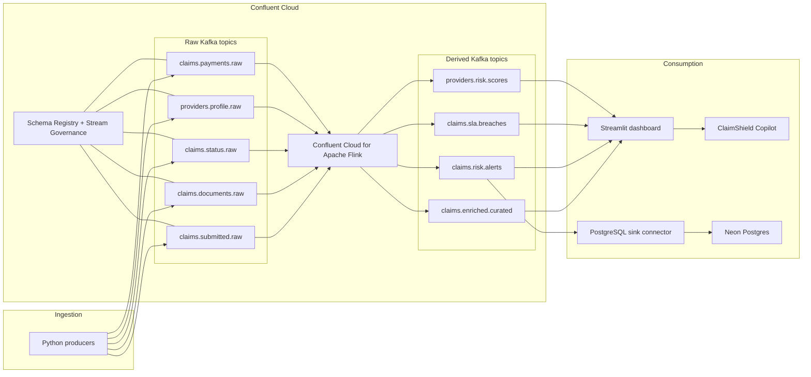
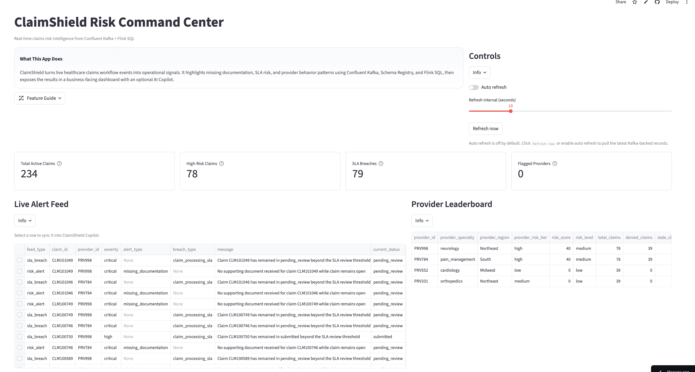
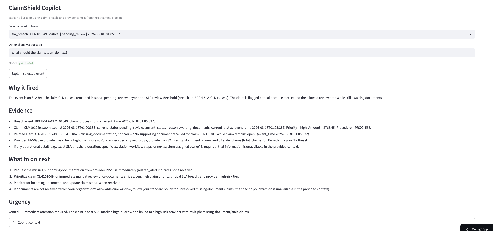

# ClaimShield

ClaimShield is a real-time healthcare claims risk intelligence platform built on Confluent Cloud. It ingests claims workflow events, governs them with schemas, applies Flink SQL rules to detect risk, publishes live alerts and provider risk scores, and surfaces the results in a business-facing dashboard with an optional AI Copilot.

**Live dashboard:** [claimshield-streaming-platform-z7akdrwfzbfeaf5pqdzvbs.streamlit.app](https://claimshield-streaming-platform-z7akdrwfzbfeaf5pqdzvbs.streamlit.app/)

## What Was Built

ClaimShield is not just a dashboard. It is a complete streaming application with:

- governed healthcare claim events in Kafka topics
- JSON Schema contracts in Schema Registry
- continuous Flink SQL pipelines for enrichment, alerts, SLA breaches, and provider scoring
- a managed PostgreSQL sink connector for downstream actionability
- a public Streamlit command center for business users
- an AI Copilot that explains why an alert fired and what to do next

## Problem

Claims teams often discover missing documentation, SLA breaches, and risky provider patterns too late. By the time those issues appear in static reports, operations teams have already lost time and escalation options.

## Solution

ClaimShield turns live claims workflow events into actionable operational signals. The platform ingests claim submissions, document uploads, status changes, and provider profile updates into Confluent Cloud, enriches them with Flink SQL, and publishes downstream streams that power a risk command center for analysts and operations teams.

## Why Confluent

ClaimShield is intentionally Confluent-native:

- Kafka topics provide the event backbone
- Schema Registry enforces event contracts
- Stream Governance adds lineage, catalog, and metadata visibility
- Confluent Cloud for Apache Flink runs the core streaming rules
- A managed PostgreSQL sink connector proves downstream actionability

The result is a governed streaming system, not a stitched-together demo.

## Architecture

The platform has four layers:

1. Ingestion: Python producers publish raw claims workflow events into Kafka topics.
2. Governance: JSON Schema contracts are registered and managed in Schema Registry.
3. Processing: Flink SQL enriches claim events, detects claim risk, flags SLA breaches, and scores providers.
4. Consumption: a Streamlit dashboard and a PostgreSQL sink consume the derived outputs.

End-to-end flow:



In practical terms, ClaimShield watches claims as they move through submission, documentation, and review. Flink turns those events into operational signals, and the dashboard turns those signals into something an analyst can act on immediately.

Raw topics:

- `claims.submitted.raw`
- `claims.documents.raw`
- `claims.status.raw`
- `providers.profile.raw`
- `claims.payments.raw`

Derived topics:

- `claims.enriched.curated`
- `claims.risk.alerts`
- `claims.sla.breaches`
- `providers.risk.scores`

## Confluent Features Used

- Kafka topics
- Schema Registry
- Stream Governance
- Stream Catalog / Data Portal
- Stream Lineage
- Confluent Cloud for Apache Flink
- Managed PostgreSQL sink connector

## Event Model

Primary event contracts:

- `claim.submitted.v1`
- `claim.document_uploaded.v1`
- `claim.status_updated.v1`
- `provider.profile_updated.v1`
- `claim.payment_processed.v1`
- `claim.risk_alert.v1`

## Flink Rules

The MVP implements three continuous rules in Flink SQL:

1. Missing documentation: raise a high-severity claim alert when required documents do not arrive while the claim is still open.
2. SLA breach risk: flag claims that remain in `submitted` or `pending_review` beyond the review threshold.
3. Suspicious provider pattern: compute rolling provider risk scores from stale claims, denials, and missing-document patterns.

## Dashboard

The dashboard is implemented in `app/dashboard.py` with Streamlit and is deployed publicly for review. It shows:

- total active claims
- high-risk claims
- SLA breaches
- flagged providers
- live alert feed
- provider leaderboard
- claim detail table



## AI Copilot

ClaimShield Copilot is an optional explanation layer inside the dashboard. A user can select a live alert or breach, review the stream context, and generate an explanation that summarizes why the event fired, what evidence supports it, what to do next, and how urgent it is.



## Business Impact

ClaimShield helps claims operations teams spot risk while workflows are still in motion. That means faster intervention on missing documents, better SLA management, and earlier visibility into provider behavior that can create operational drag or financial leakage.

## How to Run

1. Configure Confluent Cloud credentials in `.env`.
2. Register schemas from `schemas/`.
3. Create the raw topics in Confluent Cloud.
4. Run the Python producers in `producers/`.
5. Execute the Flink SQL statements in `flink/`.
6. Optionally set `OPENAI_API_KEY` and `CLAIMSHIELD_COPILOT_MODEL`.
7. Launch the dashboard with:

```bash
source .venv/bin/activate
streamlit run app/dashboard.py
```

## Deployment

The recommended free deployment target for the dashboard is Streamlit Community Cloud.

Deployment details:

- see `docs/deployment.md`
- use `.streamlit/secrets.example.toml` as the runtime secret template
- deploy `app/dashboard.py` as the app entrypoint

## Evidence

Key project evidence:

- [Confluent environment](docs/assets/confluent-environment.png)
- [Confluent cluster overview](docs/assets/confluent-cluster-overview.png)
- [Confluent topic list](docs/assets/confluent-topic-list.png)
- [Submitted claim schema](docs/assets/schema-claim-submitted.png)
- [Risk alert schema](docs/assets/schema-claim-risk-alert.png)
- [Running Flink statement](docs/assets/flink-running-statement.png)
- [Stream catalog](docs/assets/stream-catalog.png)
- [Stream lineage](docs/assets/stream-lineage.png)
- [PostgreSQL sink status](docs/assets/postgres-sink-status.png)
- [Neon alert table](docs/assets/neon-alert-table.png)

## Additional Docs

- `docs/architecture.md`
- `docs/deployment.md`
- `docs/demo_script.md`
- `docs/submission_notes.md`

## Future Enhancements

- payment anomaly rules
- document classification and extraction
- provider peer benchmarking
- case management actions from alerts
- historical replay and backtesting
