# ClaimShield

## Problem

Healthcare claims teams often react to delays, missing documentation, and provider risk patterns after SLAs are already breached. They need a live operational view of claim workflow risk, not a delayed reporting view.

## Solution

ClaimShield is a real-time healthcare claims risk intelligence app that ingests claims workflow events, governs them with schemas, processes them with Confluent Cloud for Apache Flink, emits live alerts and provider risk scores, and shows them in a business-facing dashboard. An optional AI copilot explains why alerts fired and what to do next.

## Why Confluent

ClaimShield is built around a Confluent-native architecture:

- Managed Kafka topics for event ingestion and derived streams
- Schema Registry for event contracts and compatibility control
- Stream Governance for catalog, schema visibility, and lineage
- Confluent Cloud for Apache Flink for serverless streaming SQL
- Managed connectors for ecosystem integration

This keeps core business logic in streaming infrastructure rather than custom application code.

## Architecture

Current Confluent resources:

- Environment: `claimshield-demo` (`env-xknzkk`)
- Kafka cluster: `claimshield-demo-cluster` (`lkc-v33kk5`)
- Schema Registry cluster: `lsrc-x11kkk`
- Flink compute pool / workspace layer: `claimshield-risk-workspace` (`lfcp-wnnk39`)
- Cloud / region: Azure `eastus`

High-level flow:

1. Python producers publish raw claims and provider events into Kafka.
2. Schema Registry validates event contracts.
3. Flink SQL enriches claims, detects rule violations, and publishes derived streams.
4. A Streamlit dashboard consumes alerts, breaches, and provider scores.
5. An optional AI copilot explains selected alerts using downstream context.

Architecture evidence:

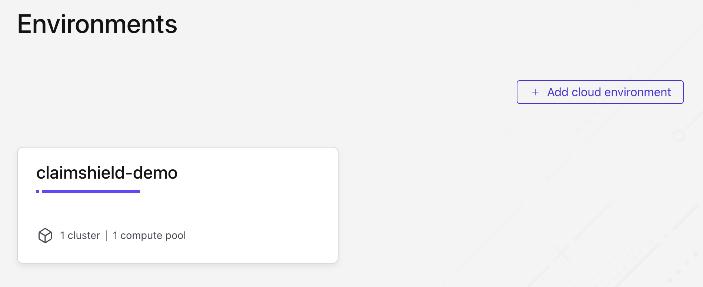

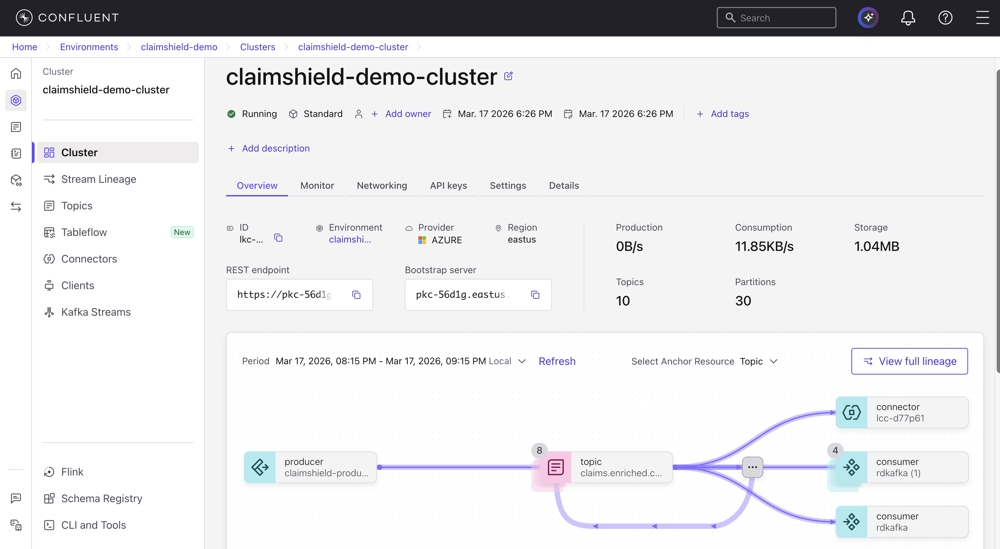

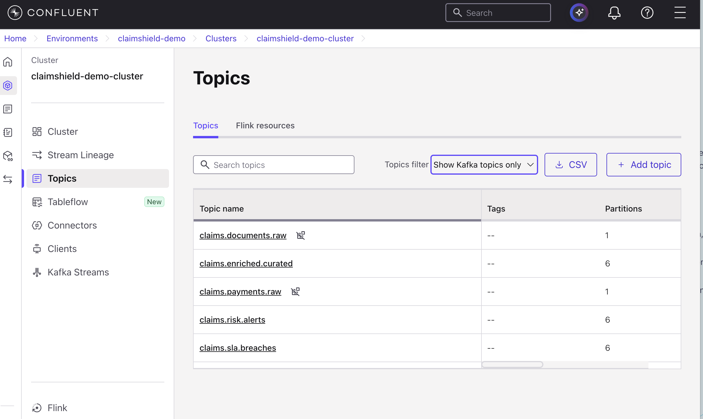

## Confluent Features Used

- Kafka topics
- Schema Registry
- Stream Governance Essentials
- Stream Catalog / Data Portal
- Stream Lineage
- Confluent Cloud for Apache Flink
- One managed connector for downstream alert delivery

Governance and lineage evidence:

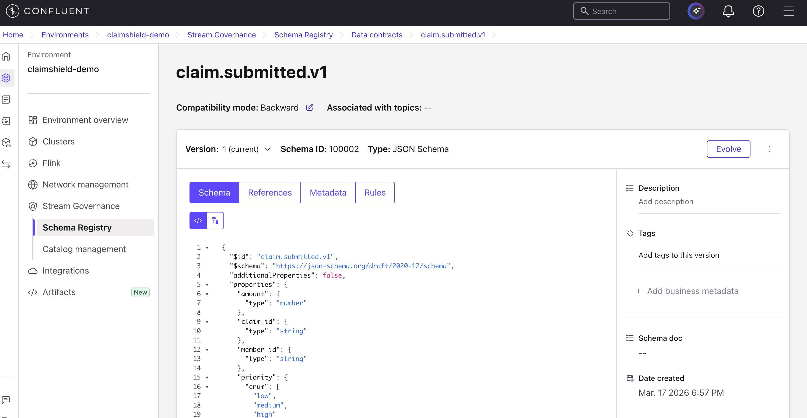

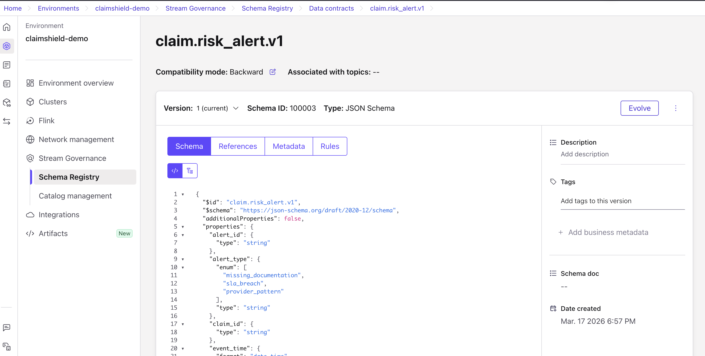

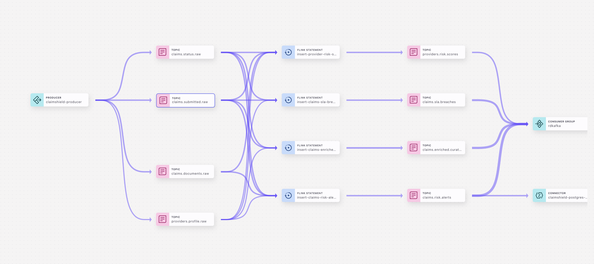

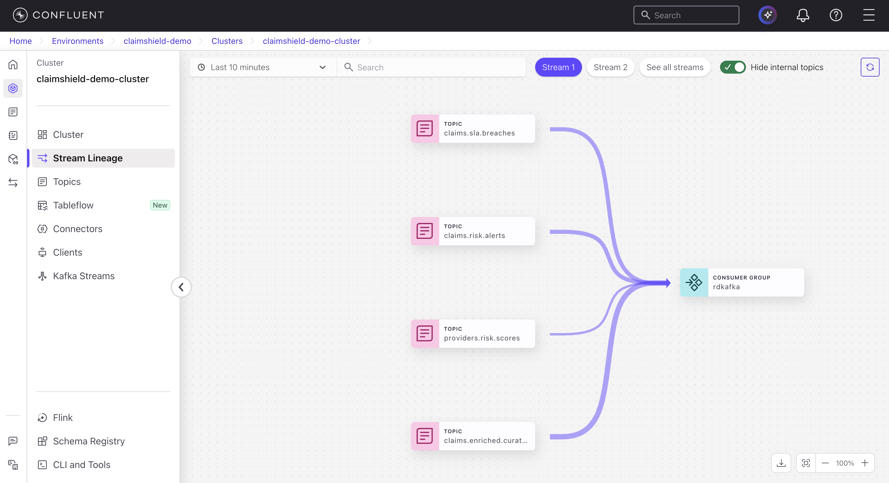

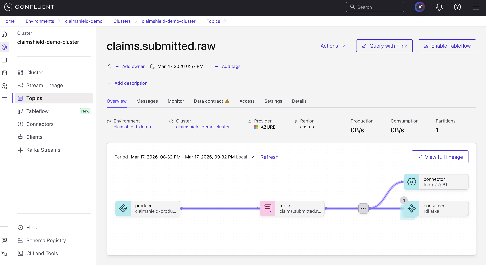

## Event Model

Raw topics:

- `claims.submitted.raw`
- `claims.documents.raw`
- `claims.status.raw`
- `providers.profile.raw`
- `claims.payments.raw`

Derived topics:

- `claims.enriched.curated`
- `claims.risk.alerts`
- `claims.sla.breaches`
- `providers.risk.scores`
- `claims.alerts.explanations`

Primary event types:

- `claim.submitted.v1`
- `claim.document_uploaded.v1`
- `claim.status_updated.v1`
- `provider.profile_updated.v1`
- `claim.payment_processed.v1`
- `claim.risk_alert.v1`

## Flink Rules

The MVP implements three continuous rules in Flink SQL:

1. Missing documentation: emit a high-severity alert when no supporting document arrives within the SLA window after submission.
2. SLA breach risk: emit a breach event when a claim remains in `submitted` or `pending_review` too long.
3. Suspicious provider pattern: compute rolling provider risk scores based on delayed or denied claim behavior.

Flink processing evidence:

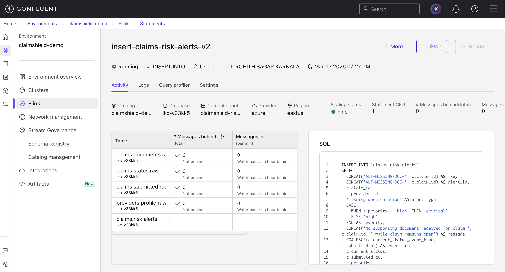

## Dashboard

The dashboard is implemented in `app/dashboard.py` with Streamlit and shows:

- Total active claims
- High-risk claims
- SLA breaches
- Flagged providers
- Live alert feed
- Provider leaderboard
- Claim detail table

Dashboard evidence:


## AI Copilot

ClaimShield Copilot is an optional downstream explanation layer in the dashboard. When a user selects an alert or breach, the app sends alert context, claim context, and provider context to an LLM and returns:

- Why the alert fired
- Supporting evidence
- Recommended next action
- Urgency level

Copilot evidence:


## Business Impact

ClaimShield reduces operational blind spots by surfacing risk earlier, helps claims teams prioritize work, and gives provider operations teams a live signal for problematic behavior patterns.

## How to Run

Run flow:

1. Configure Confluent Cloud credentials in `.env`.
2. Register schemas from `schemas/`.
3. Create raw topics in Confluent Cloud.
4. Run Python producers from `producers/`.
5. Execute Flink SQL statements from `flink/`.
6. Optionally set `OPENAI_API_KEY` and `CLAIMSHIELD_COPILOT_MODEL` for ClaimShield Copilot.
7. Launch the Streamlit app from `app/dashboard.py`.

Local dashboard launch example:

```bash
source .venv/bin/activate
streamlit run app/dashboard.py
```

## Deployment

The recommended free deployment target for the dashboard is Streamlit Community Cloud, not Vercel.

Deployment guide:

- See `docs/deployment.md`
- Add runtime secrets using `.streamlit/secrets.example.toml` as the template
- Deploy `app/dashboard.py` as the Streamlit entrypoint

Connector and sink evidence:

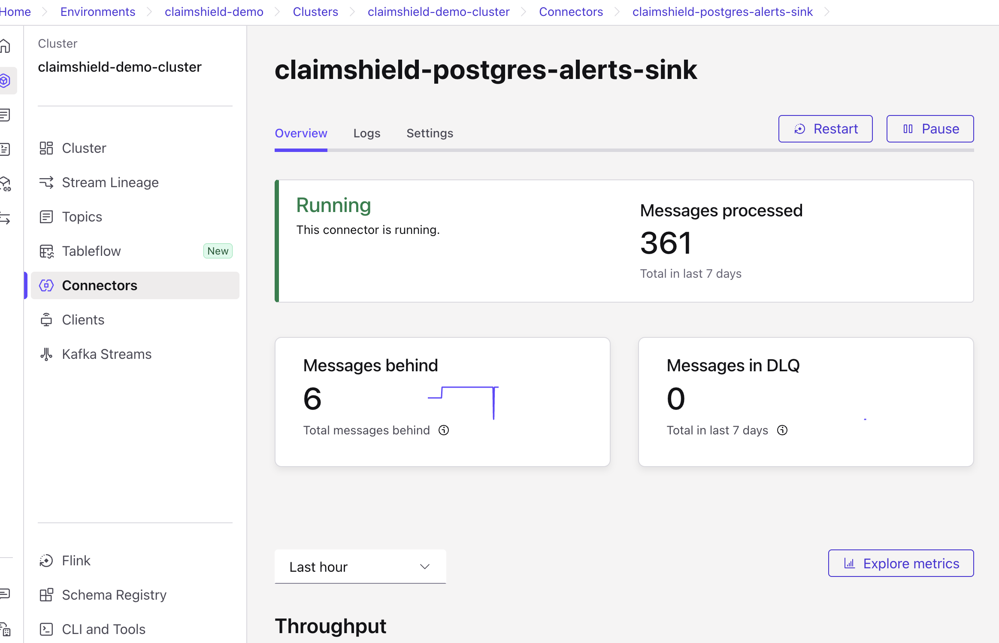

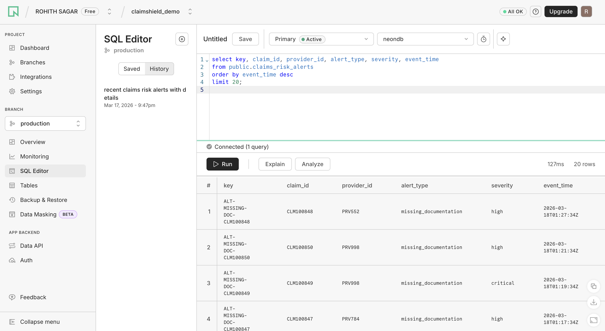

## Demo Flow

1. Show the Confluent environment, cluster, and topic list.
2. Open one schema in Schema Registry.
3. Show one running Flink statement.
4. Trigger a claim workflow event.
5. Watch a live alert appear in the dashboard.
6. Open the copilot explanation.
7. End on Stream Lineage or connector status.

Optional demo support assets:

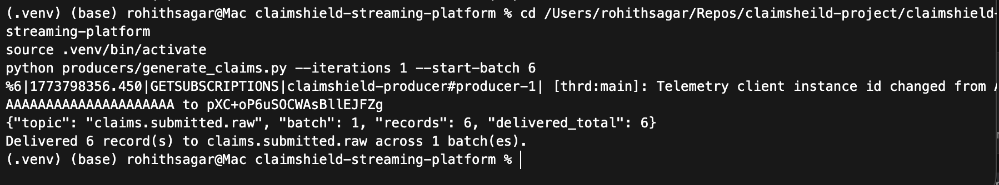

## Future Enhancements

- Add payment anomaly rules
- Add document classification and extraction
- Add provider peer grouping benchmarks
- Add case management workflow actions from alerts
- Add historical replay and backtesting
