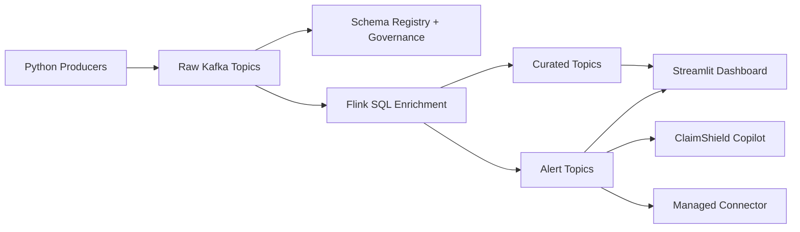

# ClaimShield Architecture

## Resource Baseline

- Environment: `claimshield-demo`
- Kafka cluster: `claimshield-demo-cluster`
- Schema Registry package: `ESSENTIALS`
- Flink compute pool: `claimshield-risk-workspace`
- Cloud / region: Azure `eastus`

## Logical Architecture

## Topic Plan

### Raw Topics

- `claims.submitted.raw`
- `claims.documents.raw`
- `claims.status.raw`
- `providers.profile.raw`
- `claims.payments.raw`

### Derived Topics

- `claims.enriched.curated`
- `claims.risk.alerts`
- `claims.sla.breaches`
- `providers.risk.scores`
- `claims.alerts.explanations`

## Data Flow

1. Python producers publish governed JSON events into raw topics.
2. Schema Registry enforces compatibility and Stream Governance catalogs the assets.
3. Flink SQL creates a curated enrichment layer from submitted claims, provider profiles, and latest status.
4. Additional continuous Flink statements emit alerts, SLA breaches, and provider scores.
5. The dashboard consumes derived streams for operational visibility.
6. The optional connector exports alerts or scores to an external system.
7. The optional copilot explains selected alerts using already-derived context.

## Design Principles

- Keep business rules in Flink SQL rather than Python.
- Keep AI downstream from deterministic streaming rules.
- Preserve clear raw-to-curated-to-alert lineage.
- Prefer domain-oriented topic names that read well in Confluent lineage views.

## Planned Flink Outputs

- `claims.enriched.curated`: joined claim, provider, and current status context
- `claims.risk.alerts`: claim-level risk alerts such as missing documentation
- `claims.sla.breaches`: claims exceeding time thresholds
- `providers.risk.scores`: rolling provider-level risk metrics

## Connector Recommendation

Preferred order:

1. HTTP Sink V2 for visible alert delivery
2. PostgreSQL Sink if an HTTP receiver is not available
3. Datagen only if a source connector is required for a side stream

## Governance Demo Story

The platform-facing demo should show:

- Schema subject visibility for at least one raw topic and one derived alert topic
- Stream Catalog / Data Portal coverage for topics and Flink outputs
- Stream Lineage from raw claims to derived alerts and provider scores
